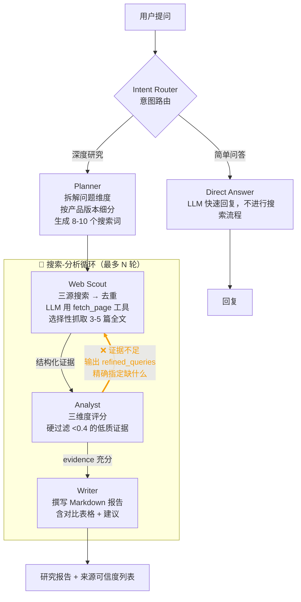

# 🔬 DeepResearch Lite

**轻量级多 Agent 深度研究助手** — 输入一个问题，自动调度 5 个 AI Agent 协作完成：意图路由 → 搜索规划 → 多源检索 → 证据评分 → 报告撰写。最终输出一份带可信度评分的 Markdown 研究报告。

简单问题秒回，复杂问题深度研究，无需手动搜索和整理资料。

## 特性

- **🤖 5 Agent 管线** — Intent Router → Planner → Web Scout → Analyst → Writer，LangGraph StateGraph 编排，证据不足自动循环补充搜索
- **🔍 三重搜索源** — 博查 API + DuckDuckGo + DeepSeek 联网搜索并行检索，覆盖主流搜索引擎
- **📊 证据可信度模型** — 三维度量化评分，低分证据自动丢弃
- **📝 专业级研究报告** — 数据表格、权威性标注的深度报告
- **⚡ SSE 流式传输** — Web 页面实时展示 Agent 执行进度（每个节点的输出都可见）
- **🧠 跨会话记忆** — SQLite 存储对话历史 + 用户画像，LLM 自动压缩旧消息
- **🌐 CLI + Web 双模式** — 终端交互模式 / FastAPI Web 服务，可 Docker 部署

## 功能

### Agent 管线




### Agent 一览

| Agent | 职责 | 关键输出 |
|-------|------|----------|
| **Intent Router** | 判断问题复杂度，路由到简单问答或深度研究管线 | `route: "direct\|multiagent"` |
| **Planner** | 拆解问题维度，生成带时间限定 + 官网优先的搜索策略 | `search_queries[]`（6-9 个） |
| **Web Scout** | 三重搜索 → URL 去重 → 前 10 条全文抓取 → 结构化证据提取 | `evidence[]`, `source_index[]` |
| **Analyst** | 三维度评分 → 硬过滤低分证据 → 判断是否需要补充搜索 | `findings[]`, `evidence_scores[]` |
| **Writer** | 撰写带数据、表格的 Markdown 报告 | `final` |


┌───────────────┬───────────────┬───────────────────┬─────────────────────────────────────────────────┐
  │     节点      │     Agent     │     有 Tool？     │                    执行方式                     │
  ├───────────────┼───────────────┼───────────────────┼─────────────────────────────────────────────────┤
  │ intent        │ Intent Router │ —                 │ LLM 推理（keyword 判 direct 则跳过 LLM）        │
  ├───────────────┼───────────────┼───────────────────┼─────────────────────────────────────────────────┤
  │ direct_answer │ 无（裸 LLM）  │ —                 │ llm.invoke() 直接回复，不经过 Agent 层          │
  ├───────────────┼───────────────┼───────────────────┼─────────────────────────────────────────────────┤
  │ plan          │ Planner       │ —                 │ agent.invoke() → 输出 JSON                      │
  ├───────────────┼───────────────┼───────────────────┼─────────────────────────────────────────────────┤
  │ web_scout     │ Web Scout     │ fetch_page        │ agent.invoke() 带工具，LLM 自主决定抓取哪些页面 │
  ├───────────────┼───────────────┼───────────────────┼─────────────────────────────────────────────────┤
  │ analyst       │ Analyst       │ search_supplement │ agent.invoke() 带工具，LLM 自主决定何时补搜     │
  ├───────────────┼───────────────┼───────────────────┼─────────────────────────────────────────────────┤
  │ writer        │ Writer        │ —                 │ agent.invoke() → 输出 Markdown                  │
  └───────────────┴───────────────┴───────────────────┴─────────────────────────────────────────────────┘
### 证据可信度模型

```
reliability = relevance × 0.4 + freshness × 0.3 + authority × 0.3
```

| 等级 | 阈值 | 来源特征 |
|------|------|----------|
| 🟢 高信度 | ≥ 0.7 | 官网 / 政府 (.gov) / 学术 (.edu) / 权威媒体 |
| 🟡 中信度 | ≥ 0.4 | 企业网站 / 知名博客 / 行业报告 |
| 🔴 低信度 | < 0.4 | **自动丢弃**，不足时触发补充搜索 |

### 搜索系统

| 源 | API Key | 特点 |
|----|---------|------|
| **博查 API** | 可选（推荐） | `freshness=Month` 近一月结果，Month 不足时自动 fallback Year |
| **DuckDuckGo** | 免费 | `timelimit='m'` 近一月结果，无 API Key 需求 |
| **DeepSeek web_search** | 自带 | LLM 级联网搜索，返回日期信息 |

- 失效内容软过滤（404/下架/deprecated），时效性交由 Analyst Agent 判断
- LLM 审阅搜索摘要后用 `fetch_page` 工具选择性抓取 3-5 篇全文（不再盲抓全部）


## 快速开始

```bash
# 1. 安装依赖
pip install -r requirements.txt

# 2. 配置 API Key
cp .env.example .env
# 编辑 .env，填入 DEEPSEEK_API_KEY（必填），BOCHA_API_KEY（可选但推荐）

# 3. CLI 模式（单次查询）
python main.py --query "分析2026年AI行业就业趋势与薪资水平"

# 4. CLI 交互模式
python main.py

# 4. Web 服务
python server.py
# 浏览器打开 http://localhost:8764
```

### Docker 部署

```bash
# 1. 配置
cp .env.example .env
# 编辑 .env，填入真实 API Key

docker compose up -d

# 3. 查看进度
docker compose logs -f

# 4. 停止
docker compose down
```

浏览器打开 `http://<服务器IP>:8764`。


## 项目结构

```
deepresearch/
├── .env.example           # 配置模板
├── .gitignore
├── .dockerignore
├── Dockerfile             # python:3.11-slim 镜像
├── docker-compose.yml     # 含 healthcheck + 持久化 volume
├── requirements.txt
├── main.py                # CLI 入口（单次查询 + 交互模式）
├── server.py              # FastAPI Web 服务 + SSE 流式接口
│
├── agent/
│   ├── config.py          # pydantic-settings 配置类
│   ├── state.py           # ResearchState（15 个字段在节点间流转）
│   ├── prompts.py         # 5 个 Agent 系统提示词（均要求 JSON 输出）
│   ├── tools.py           # 搜索工具（博查/DDG/DeepSeek）+ 抓取 + 过滤
│   ├── nodes.py           # 6 个 LangGraph 节点函数
│   └── graph.py           # StateGraph 工作流定义 + 条件路由
│
├── memory/
│   └── store.py           # SQLite 记忆存储（对话历史 + 用户画像）
│
├── static/
│   ├── index.html         # 深色主题 Web 前端
│   ├── app.js             # SSE 客户端 + Markdown 渲染 + 交互逻辑
│   └── style.css          # 样式
│
└── data/                  # SQLite 数据库（自动创建，已 gitignore）
```

## 环境变量

| 变量 | 必填 | 默认值 | 说明 |
|------|------|--------|------|
| `DEEPSEEK_API_KEY` | ✅ | — | DeepSeek API Key |
| `DEEPSEEK_BASE_URL` | — | `https://api.deepseek.com/v1` | API 地址 |
| `MODEL` | — | `deepseek-chat` | LLM 模型名 |
| `BOCHA_API_KEY` | — | 空 | 博查搜索 API Key（不填仅用 DDG + DeepSeek） |
| `MAX_ITERATIONS` | — | `2` | 搜索-分析最大循环次数 |
| `ENABLE_MEMORY` | — | `true` | 跨会话记忆开关 |
| `DB_PATH` | — | `data/memory.db` | SQLite 数据库路径 |
| `HOST` | — | `0.0.0.0` | 服务监听地址 |
| `PORT` | — | `8764` | 服务端口 |

## API 接口

| 方法 | 路径 | 说明 |
|------|------|------|
| POST | `/api/v1/research/stream` | **SSE 流式研究** — `{query, user_id?, thread_id?}` |
| GET | `/` | 返回前端页面 |
| GET | `/health` | 健康检查 `{"status":"ok"}` |
| GET | `/docs` | FastAPI Swagger 文档 |

### 流式接口示例

```bash
curl -X POST http://localhost:8764/api/v1/research/stream \
  -H "Content-Type: application/json" \
  -d '{"query":"对比 Python 和 Go 后端开发差异"}' \
  --no-buffer
```

## 技术栈

| 层 | 技术 |
|----|------|
| **编排** | LangGraph StateGraph（5agent + 6 节点 + 条件路由） |
| **LLM** | DeepSeek Chat API（可切换为任意 OpenAI 兼容 API） |
| **搜索** | 博查 API + DuckDuckGo + DeepSeek web_search |
| **存储** | SQLite（LangGraph Checkpoint + 对话记忆） |
| **Web** | FastAPI + SSE 流式传输 |
| **前端** | 原生 HTML/CSS/JS（零框架依赖）

