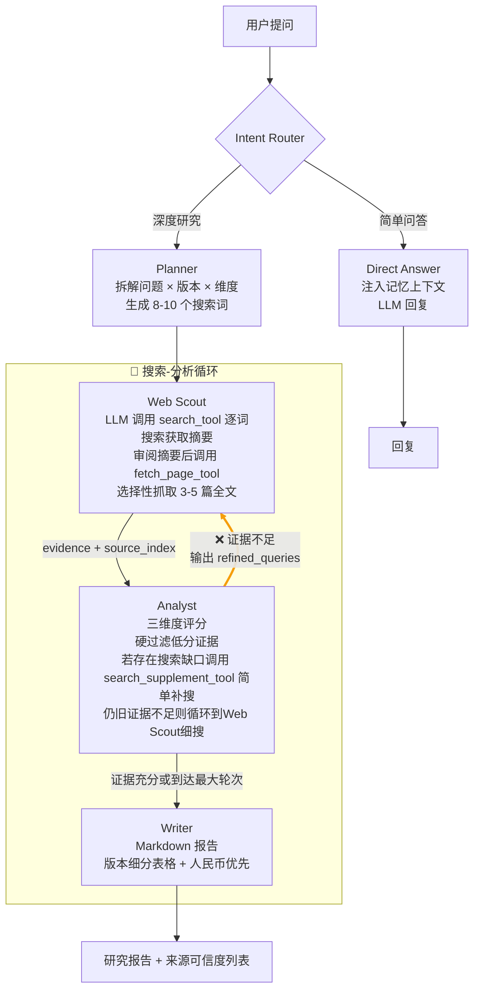

# 🔬 DeepResearch

多 Agent 协作深度研究助手 — 输入一个问题，5 个 AI Agent 自动完成意图路由 → 搜索规划 → 网络取证 → 证据评分 → 报告撰写。简单问题秒回，复杂问题输出带可信度评分的 Markdown 研究报告。

## 特性

- **5 Agent 管线** — LangGraph StateGraph 编排，Analyst 发现证据不足时自主输出精确搜索词触发循环补搜
- **LLM 自主调用工具** — 搜索、页面抓取、定向补搜均由 Agent 在 tool-calling 循环中自主决策，节点函数只传指令和兜底
- **证据可信度模型** — 三维度加权评分，低分自动丢弃，证据不足时透明警告
- **跨会话记忆** — SQLite 存储对话历史 + 用户画像，追问不重搜，长回答 LLM 压缩为要点
- **SSE 流式传输** — 每个 Agent 的执行状态和结果实时可见
- **频率保护** — per-IP 每小时 5 次 + 全局并发 3，本地/内网自动绕过
- **CLI + Web + Docker** — 三模式，零前端框架依赖

## Agent 管线



## 工具总览

| 工具 | 绑定 Agent | 底层实现 | 调用时机 | 返回内容 |
|------|-----------|---------|---------|---------|
| `search_tool` | Web Scout | `search_all([q], 4)` 三源去重 | 每个搜索词调一次；结果少时换词重搜 | 格式化摘要（编号/标题/URL/摘要/日期） |
| `fetch_page_tool` | Web Scout | urllib 抓取 → 去标签 → 8KB 截断 | 审阅摘要后挑 3-5 篇确定相关的页面 | 网页纯文本正文 |
| `search_supplement_tool` | Analyst | `search_all([q], 3)` 轻量搜索 | 评分时发现具体维度缺数据 | 简洁摘要（不抓全文） |

---

## 证据可信度模型

```
reliability = relevance × 0.4 + freshness × 0.3 + authority × 0.3
```

| 等级 | 阈值 | 来源示例 | 处理 |
|------|------|----------|------|
| 🟢 高信度 | ≥ 0.7 | 官网 / .gov / .edu / 权威媒体 | 优先采用 |
| 🟡 中信度 | ≥ 0.4 | 企业网站 / 知名博客 / 行业报告 | 可用 |
| 🔴 低信度 | < 0.4 | 论坛 / 个人博客 / 无法判断 | **丢弃** |

---

## 搜索系统

| 源 | API Key | 时效窗口 | 说明 |
|----|---------|----------|------|
| **博查 API** | 可选 | Month（< 3 条 fallback Year） | 主力，需申请 Key |
| **DuckDuckGo** | 免费 | Month（`timelimit='m'`） | 零配置备用 |
| **DeepSeek web_search** | 自带 | — | 仅前 4 词调用，省 API |

---

## 记忆系统

SQLite 单文件 `data/memory.db`，两张表：`conversations`（对话消息）和 `user_profile`（用户画像）。

### 写入

1. **存消息** — user 问题 + assistant 回答全文存入 DB
2. **提取画像** — 关键词匹配"我叫/我是/我做/我会/我毕业于/我住在"等 → 更新 user_profile.facts

### 读取

`build_memory_context()` 拼文本注入各 Agent 的 prompt。画像永久保留，对话取全局最新 4 轮（8 条）。用户问题原文注入，长 AI 回答（>500字）LLM 压缩为要点保留数据和结论。前端 `thread_id` 存 localStorage。

### 效果

用户追问"根据刚才的报告..."→ Intent Router 读到上下文 → 判 direct → 不重搜

---

## 频率限制

纯内存计数器（`auth.py`），重启清零。本地/内网 IP 直接放行（127.*, ::1, 192.168.*, 10.*, 172.16-31.*）。外网 IP 每小时 5 次 + 全局并发 3。超限返回友好中文提示。

---

## 快速开始

```bash
pip install -r requirements.txt
cp .env.example .env
# 编辑 .env，必填 DEEPSEEK_API_KEY，可选 BOCHA_API_KEY

# CLI
python main.py --query "对比 DeepSeek、ChatGPT、Claude 最新定价"
python main.py  # 交互模式

# Web
python server.py
# http://localhost:8764
```

### Docker

```bash
cp .env.example .env
docker compose up -d
# http://<服务器IP>:8764
```

---

## 项目结构

```
deepresearch/
├── main.py                # CLI 入口
├── server.py              # FastAPI + SSE
├── auth.py                # 频率限制（本地绕过）
├── agent/
│   ├── config.py          # pydantic-settings
│   ├── state.py           # ResearchState（19 字段）
│   ├── prompts.py         # 5 个 Agent 系统提示词
│   ├── tools.py           # 搜索工具 + 3 个 LangChain Tool
│   ├── nodes.py           # 6 个节点函数
│   └── graph.py           # StateGraph + 条件路由
├── memory/
│   └── store.py           # SQLite 记忆（对话 + 画像 + 压缩）
├── static/
│   ├── index.html
│   ├── app.js
│   └── style.css
└── data/                  # SQLite 数据库（gitignore）
```

## 环境变量

| 变量 | 必填 | 默认值 | 说明 |
|------|------|--------|------|
| `DEEPSEEK_API_KEY` | ✅ | — | DeepSeek API Key |
| `DEEPSEEK_BASE_URL` | — | `https://api.deepseek.com/v1` | API 地址 |
| `MODEL` | — | `deepseek-chat` | 模型名 |
| `BOCHA_API_KEY` | — | 空 | 博查搜索 Key |
| `MAX_ITERATIONS` | — | `2` | 搜索-分析循环上限 |
| `ENABLE_MEMORY` | — | `true` | 记忆开关 |
| `HOST` / `PORT` | — | `0.0.0.0` / `8764` | 监听 |
| `RATE_LIMIT_PER_HOUR` | — | `5` | 每 IP 每小时上限 |
| `RATE_LIMIT_CONCURRENCY` | — | `3` | 全局并发上限 |

## 技术栈

LangGraph / LangChain / DeepSeek Chat API / FastAPI + SSE / DuckDuckGo Search / SQLite / 原生 HTML/CSS/JS
