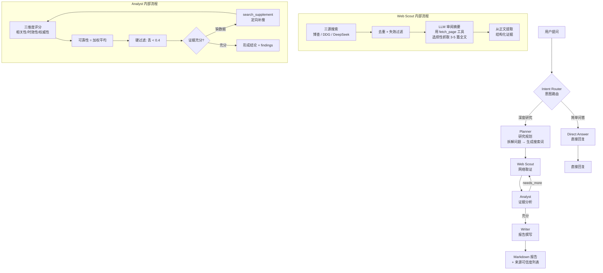

# 🔬 DeepResearch

多 Agent 协作深度研究助手 — 自动搜索、交叉验证、生成带可信度评分的专业研究报告。

## 功能

**🤖 5 Agent 协作** — 意图路由 → 研究规划 → 网络取证 → 证据分析 → 报告撰写。每个 Agent 各司其职，LangGraph 编排流转。

**🔍 三源联合搜索** — 博查 API + DuckDuckGo + DeepSeek 联网搜索，去重合并，按需抓取完整页面正文。

**📊 证据可信度模型** — 三维量化评分（相关性 × 权威性 × 时效性），低质量证据自动丢弃，证据不足时触发定向补充搜索。

**🔄 智能补搜循环** — Analyst 发现证据缺口后不是简单重搜，而是自行生成精确搜索词，Web Scout 用新词定点补搜。

**📝 结构化报告** — Markdown 格式输出。

**🛡️ 频率保护** — 每 IP 每小时 3 次深度研究 + 全局并发限制，防 API 账单失控。

## 系统流程

### 深度研究管线



### Agent 工具一览

| Agent | 工具 | 类型 | 说明 |
|-------|------|------|------|
| Intent Router | — | 纯推理 | 判断问题复杂度，根据对话历史识别追问/建议类问题 |
| Planner | — | 纯推理 | 拆解问题维度，按产品版本/档次生成 8-10 个精确搜索词 |
| **Web Scout** | `fetch_page` | LangChain Tool | LLM 看完搜索摘要后自主决定抓取哪些页面全文，只抓最相关的 3-5 篇 |
| **Analyst** | `search_supplement` | LangChain Tool | 发现具体数据缺口时定向补搜（如缺少某产品某版本的定价），输出精确搜索词 |
| Writer | — | 纯推理 | 基于分析结论撰写报告，含对比表格和建议 |

### 证据可信度模型

```
reliability = relevance × 0.4 + freshness × 0.3 + authority × 0.3
```

| 等级 | 阈值 | 来源示例 |
|------|------|----------|
| 🟢 高信度 | ≥ 0.7 | 官网、政府 .gov、学术 .edu、权威媒体 |
| 🟡 中信度 | ≥ 0.4 | 企业网站、知名博客、技术社区 |
| 🔴 低信度 | < 0.4 | **自动丢弃，不计入报告** |

## 快速开始

```bash
# 1. 安装依赖
pip install -r requirements.txt

# 2. 配置
cp .env.example .env
# 编辑 .env，必填 DEEPSEEK_API_KEY，可选 BOCHA_API_KEY

# 3. CLI 模式
python main.py --query "对比 DeepSeek 和 ChatGPT 最新定价"

# 4. Web 服务
python server.py
# 浏览器打开 http://localhost:8764
```

## Docker 部署

```bash
cp .env.example .env
# 编辑 .env，填入 DEEPSEEK_API_KEY

docker compose up -d
```

启动后访问 `http://服务器IP:8764`。

## 环境变量

| 变量 | 必填 | 说明 |
|------|------|------|
| `DEEPSEEK_API_KEY` | ✅ | DeepSeek API Key |
| `DEEPSEEK_BASE_URL` | — | 默认 `https://api.deepseek.com/v1` |
| `MODEL` | — | 默认 `deepseek-chat` |
| `BOCHA_API_KEY` | — | 博查搜索 API Key（不填仅用 DDG + DeepSeek） |
| `MAX_ITERATIONS` | — | 搜索-分析最大循环次数，默认 2 |
| `ENABLE_MEMORY` | — | 跨会话记忆，默认 true |
| `HOST` / `PORT` | — | 监听地址，默认 `0.0.0.0:8764` |
| `RATE_LIMIT_PER_HOUR` | — | 每 IP 每小时研究次数，默认 3 |
| `RATE_LIMIT_CONCURRENCY` | — | 全局最大并发研究数，默认 3 |

## 项目结构

```
├── main.py               # CLI 入口（单次查询 + 交互模式）
├── server.py             # FastAPI Web 服务 + SSE 流式推送
├── auth.py               # 频率限制器（per-IP + 全局并发）
├── agent/
│   ├── config.py         # 配置类（pydantic-settings）
│   ├── state.py          # ResearchState 状态定义（16 字段）
│   ├── prompts.py        # 5 个 Agent 系统提示词
│   ├── tools.py          # 搜索工具（博查/DDG/DeepSeek）+ LangChain Tool
│   ├── nodes.py          # 6 个 LangGraph 节点函数
│   └── graph.py          # StateGraph 工作流 + 条件路由
├── memory/
│   └── store.py          # SQLite 跨会话记忆
├── static/
│   ├── index.html        # 前端页面
│   ├── app.js            # SSE 客户端 + Markdown 渲染
│   └── style.css         # 样式
└── data/                 # SQLite 数据库（自动创建）
```

## 技术栈

FastAPI / LangGraph / LangChain / DeepSeek Chat API / DuckDuckGo Search / SQLite / 原生 HTML/CSS/JS（零前端依赖）
